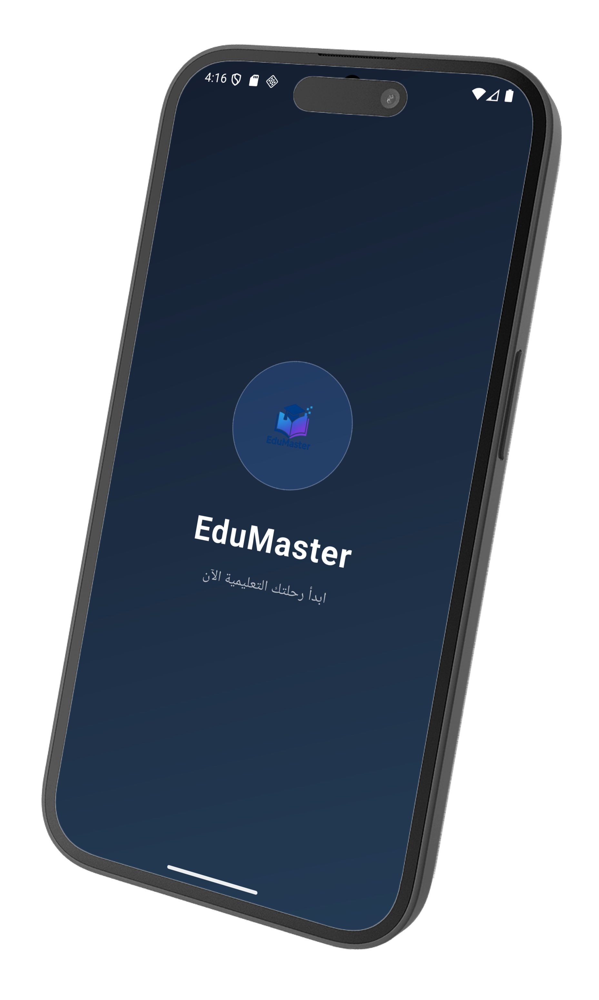
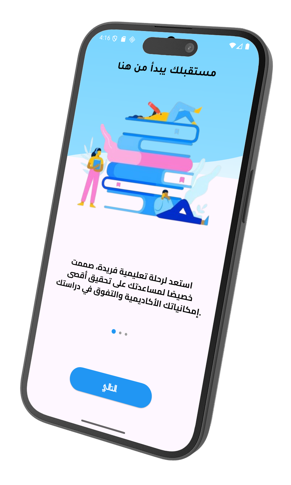
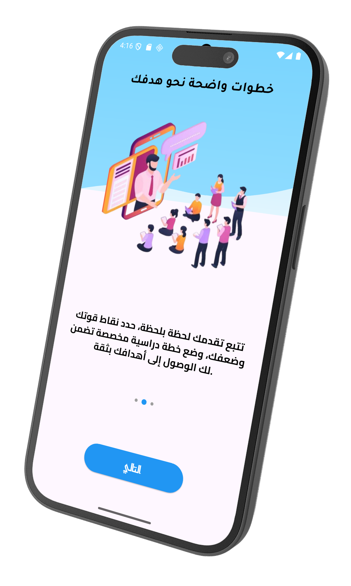
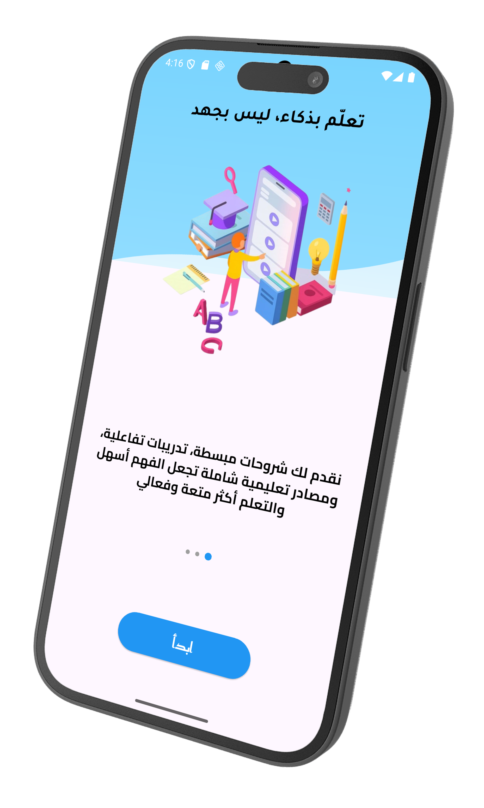
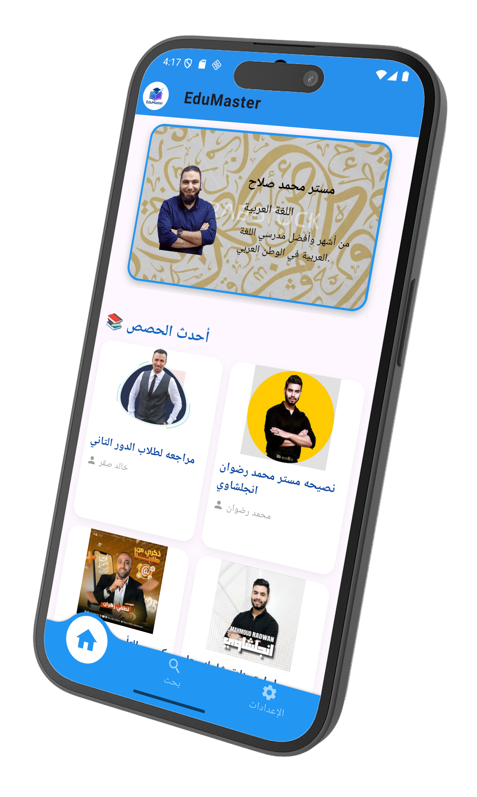
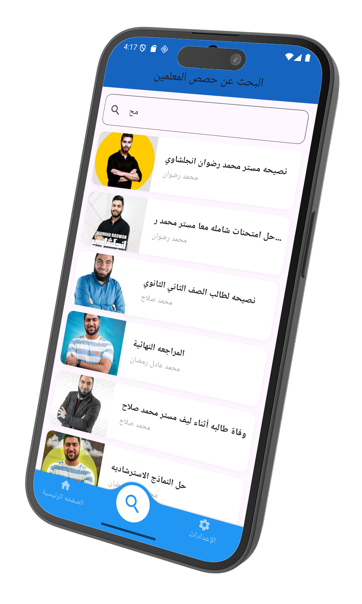
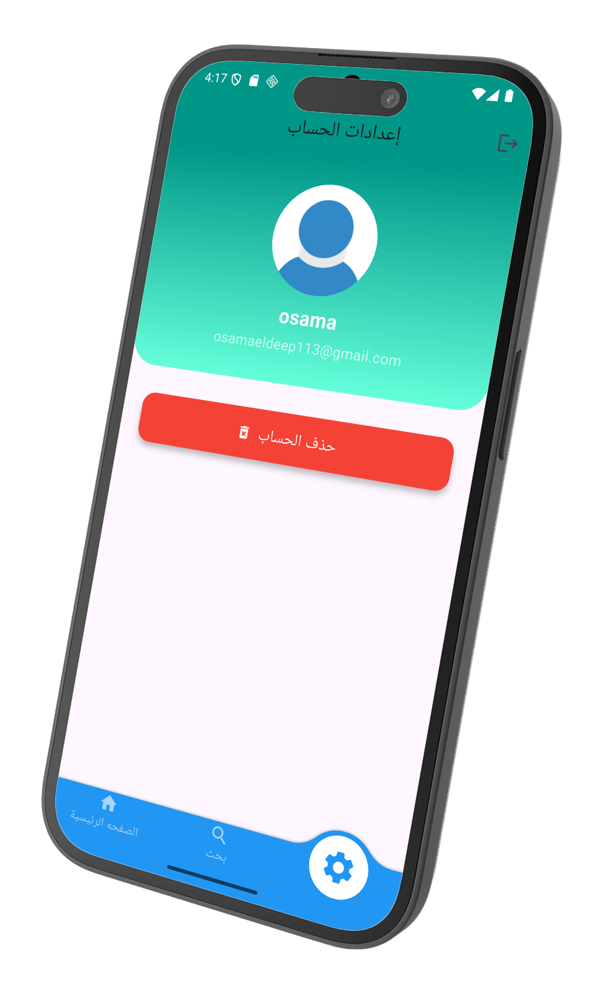
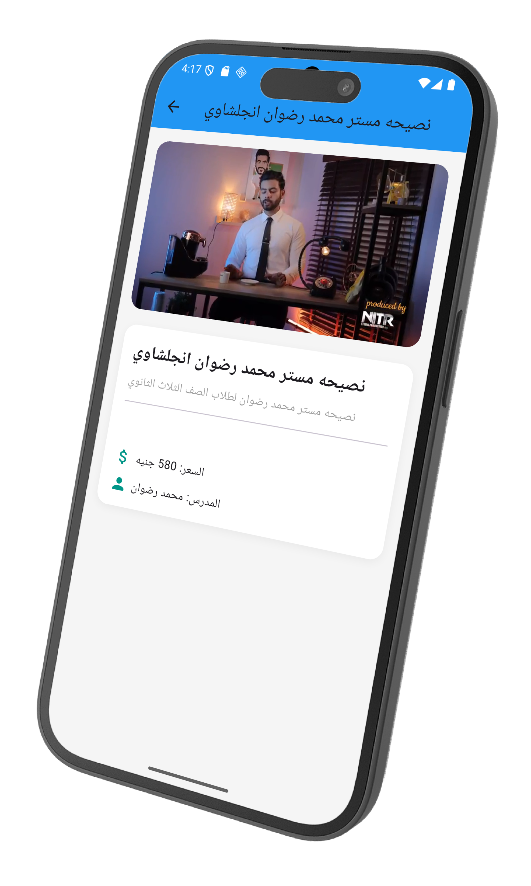
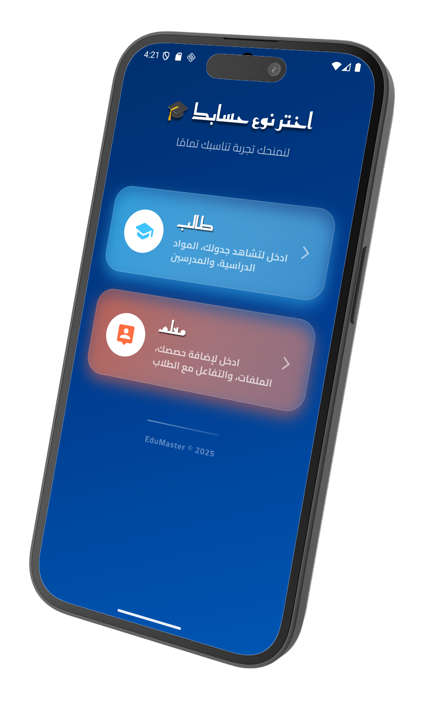
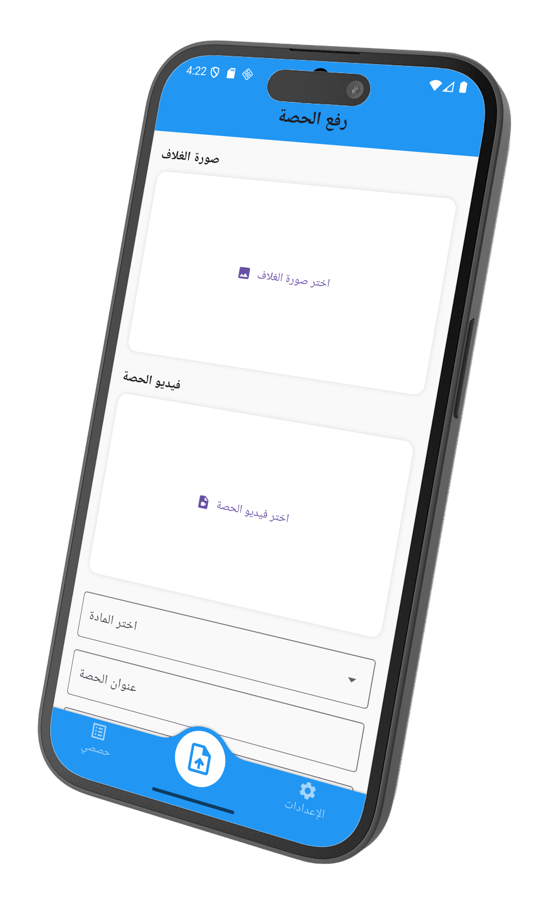

<!-- 🚀 Cyberpunk Neon Banner -->
<p align="center">
  
</p>

<h1 align="center" style="
  font-size: 45px;
  background: linear-gradient(90deg, #ff00cc, #00ffff, #ff8a00, #e52e71);
  -webkit-background-clip: text;
  color: transparent;
  font-weight: bold;
  text-shadow: 0 0 10px rgba(255,0,255,0.8), 0 0 20px rgba(0,255,255,0.8);
">
  🚀 Edu Master – The Ultimate Learning Experience
</h1>

<p align="center">
  <b>Learn smarter. Teach faster. Edu Master.</b><br>
  
</p>

---

## 🌌 Overview

**Edu Master** is a next-generation **education app** built with **Flutter** 🐦.  
Designed for **teachers** to upload lessons easily and for **students** to search, watch, and learn anytime, anywhere.  
Seamlessly integrated with **Firebase Authentication** for secure sign-up and login.

<p align="center">
  
</p>

---

## ✨ Key Features

| 🌟 Feature | 💡 Description |
|-----------|----------|
| 🎯 **Modern UI/UX** | Cyberpunk neon style with smooth animations. |
| 🎥 **Video Lessons** | Watch uploaded lessons anytime. |
| 🔍 **Lesson Search** | Find your class instantly. |
| 👨‍🏫 **Teacher Dashboard** | Upload lessons with ease. |
| 🔐 **Secure Login** | Firebase Authentication for safety. |
| 📚 **Organized Content** | Lessons arranged for easy navigation. |

---

## 🔥 Why Edu Master is Unique

Edu Master is not just another learning app – it’s **one of a kind**.  
With a **futuristic interface**, **seamless learning experience**, and **real-time updates**,  
it empowers teachers and students to connect like never before.  
There’s truly **nothing like it**.

---

## 🖼 Screenshots

<div align="center" style="padding: 15px; background: linear-gradient(135deg, rgba(255,0,255,0.05), rgba(0,255,255,0.05)); border-radius: 15px;">

|  |  |  |
|---|---|---|
|  |  |  |
|  |  |  |
|  |  |  |

</div>

---

## 🛠 Tech Stack

<p align="center">
  
  
  
  
  
</p>

---

## ⚡ Getting Started

```bash
# 1️⃣ Install Flutter
https://docs.flutter.dev/get-started/install

# 2️⃣ Clone the repository
git clone https://github.com/yourusername/edu_master.git

# 3️⃣ Navigate to the project folder
cd edu_master

# 4️⃣ Install dependencies
flutter pub get

# 5️⃣ Run the app
flutter run
